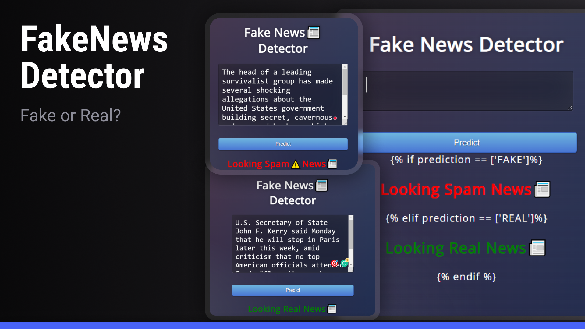

<h1 align="center">Fake News Detector</h1>

  <a href="#-Technologies">Technologies</a>&nbsp;&nbsp;&nbsp;|&nbsp;&nbsp;&nbsp;
  <a href="#-Project">Project</a>&nbsp;&nbsp;&nbsp;|&nbsp;&nbsp;&nbsp;
  <a href="#memo-licença">License</a>

  

 

  

## 💻 Technologies

This project was developed using the following technologies:

- HTML and CSS
- JavaScript
- Git and GitHub
- Python
- Flask
- Dataset

## 🚀 Project

The application was developed for academic purposes, aiming to interact with social media users who may be exposed to fake news. Based on a dataset model, the application allows users to input a news headline and verify its authenticity. The response is provided with an accuracy based on a model trained using machine learning techniques.

---
## 📜 Usage: 

- Clone my repository.
- Open CMD in working directory.
- Run `pip install -r requirements.txt`
- Open project in any IDE(Pycharm or VSCode)
- Run `Fake_News_Det.py`, go to the `http://127.0.0.1:5000/`
- If you want to build your model with the some changes, you can check the `Fake_News_Detection.ipynb`.
- You can check web app is working fine. Sometimes predictions may be wrong.

## License

This project is under the MIT license.